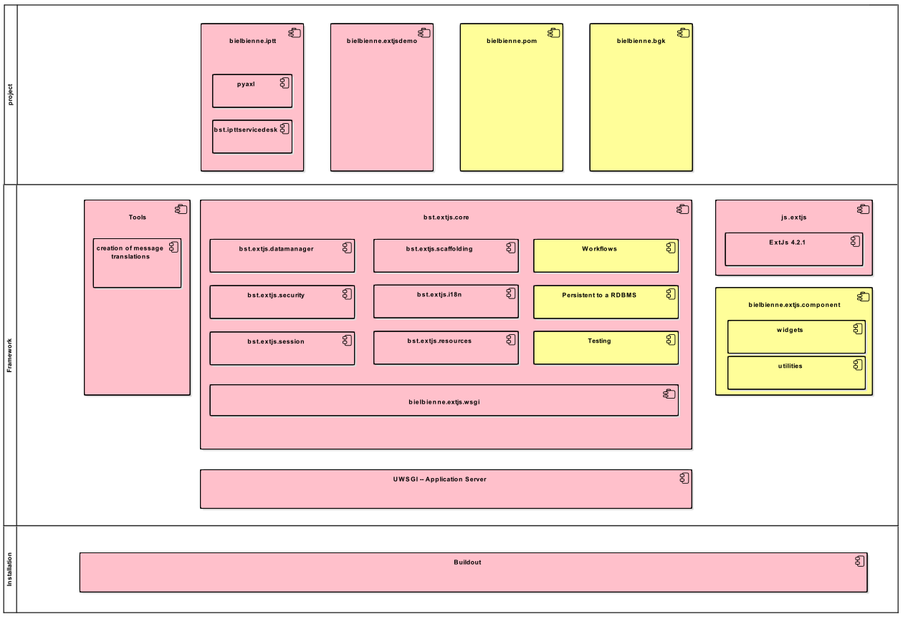

.. image:: https://travis-ci.org/bielbienne/bst.pygasus.demo.svg?branch=master
    :target: https://travis-ci.org/bielbienne/bst.pygasus.demo

.. contents::

Introduction
============

Pygasus is a new Python 3 framework to build web applications with
`Sencha ExtJS <https://www.sencha.com/products/extjs/#overview>`_. Pygasus is designed to be full
customizable for your project. 

bst.pygasus and all corresponding submodules are licensed under the ZPL 2.1, see LICENSE.txt for details.

Architecture
------------

   yellow modules are planned to be developed in the near future

The various packages are:

bst.extjs.core
    The core package of the framework that assembles all required packages together.

bst.extjs.datamanager
    The datamanager manages data coming from the client and data sent to the client's browser.

bst.extjs.i18n
    This package handles the translation for multilingual sites and applications.

bst.extjs.scaffolding
    Scaffolding is a package to generate standard models, stores, views and grids for ExtJs. 

bst.extjs.security
    This package provide a default login mask and a pluggable authentication. In the future we also plan to
    implement a role based permission model.

bst.extjs.session
    This package creates a cookie on client browsers and provides a server side session store.

bst.extjs.wsgi
    The layer needed to let the application work as a WSGI server.

bst.extjs.resources
    This package is responsible to share all needed static resources with the client.

Getting started
===============

Recommendation
--------------

The ZCA (Zope component Architectur) is a main element in this framework. If you are not familiar with it, we recommend you first learn its basics. You can follow the links at the bottom of this page.

Buildout
--------

We recommend to setup up a buildout for your project. First It will install all required dependencies and the scripts needed to run a server.

File structure:

.. code::

    buildout
    ├── bootstrap.py
    ├── buildout.cfg
    └── etc
        ├── deploy.ini.in
        └── site.zcml.in

.. code:: ini

    [buildout]
    
    extends = 
        
    parts =
        app
        zcml
    
    extensions = mr.developer
    update-versions-file = versions.cfg

    auto-checkout =
        paste
        js.extjs
        bst.pygasus.core
        bst.pygasus.wsgi
        bst.pygasus.scaffolding
        bst.pygasus.datamanager
        bst.pygasus.resources
        bst.pygasus.security
        bst.pygasus.session
        bst.pygasus.i18n
        bst.pygasus.demo
    
    [debug_ini]
    recipe = collective.recipe.template
    input = etc/deploy.ini.in
    output = ${buildout:parts-directory}/etc/${:outfile}
    outfile = debug.ini
    
    [zcml]
    recipe = collective.recipe.template
    input = etc/site.zcml.in
    output = ${buildout:parts-directory}/etc/${:outfile}
    outfile = site.zcml
    
    [app]
    recipe = zc.recipe.egg:script
    arguments="${debug_ini:output}"
    eggs =
        bst.pygasus.wsgi
        ${app:eggs}

Run your buildout

.. code:: bash

    $ cd buildout
    $ python3 boostrap.py
    $ ./bin/buildout

Create an application
---------------------

TODO

Demo application
----------------
We have a demo application that you can easy install with a buildout file. If you are interested, please follow the instruction at `bst.pygasus.demo <https://github.com/bielbienne/bst.pygasus.demo>`_..

Additional References
=====================

* http://zopeinterface.readthedocs.org/en/latest/
* http://zopecomponent.readthedocs.org/en/latest/
* https://www.python.org/dev/peps/pep-0333/
* https://pypi.python.org/pypi/martian
* https://pypi.python.org/pypi/zc.buildout/2.4.0
* http://grok.zope.org/documentation/tutorial/grok-poller-tutorial/adapters
* http://www.fanstatic.org/en/latest/

About us
========
We are the IT Services of Biel/Bienne, Switzerland.
http://foss.biel-bienne.ch/blog/

